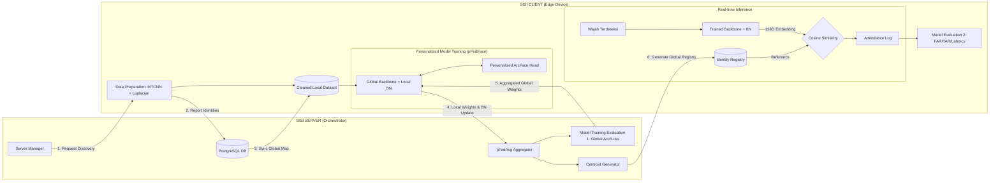

# Arsitektur dan Alur Program Federated Learning (FL)

Dokumen ini menjelaskan struktur kotak (box), sub-kotak (box inside box), dan hubungan garis antar komponen dalam sistem absensi wajah berbasis Federated Learning yang telah diimplementasikan.

---

## 1. Tahap Persiapan Data (Edge Side)
**Box Utama: [Terminal Edge - Raspberry Pi/Jetson]**
*   **Box Inside Box: [Data Acquisition Module]**
    *   Fungsi: Menangkap aliran video dari kamera USB/CSI.
*   **Box Inside Box: [Image Processor (Pre-processing)]**
    *   **Laplacian Variance Filter**: Menyeleksi ketajaman gambar (Anti-Blur).
    *   **MTCNN Detector**: Deteksi koordinat wajah dan landmark (Mata, Hidung, Mulut).
    *   **Affine Transform Alignment**: Rotasi dan skala wajah agar posisi mata sejajar.
    *   **Data Balancing**: Mengambil 50 sampel wajah terbaik per identitas.
*   **Garis Hubungan**: Mengirim *Cleaned Image Dataset* ke folder lokal untuk pelatihan.

---

## 2. Tahap Pembelajaran Terfederasi (Federated Orchestration)
Tahap ini melibatkan interaksi antara Server (Orchestrator) dan banyak Client (Terminal).

**Box Utama: [FL Server - Orchestrator]**
*   **Box Inside Box: [FedAvg Aggregator]**
    *   Fungsi: Menggabungkan bobot model (`.pth`) dari berbagai client menjadi satu model global.
*   **Box Inside Box: [Phase Controller]**
    *   Fungsi: Mengatur transisi fase (`discovery` -> `syncing` -> `training`).

**Box Utama: [FL Client - Terminal]**
*   **Box Inside Box: [Local Trainer Unit]**
    *   **Backbone (MobileFaceNet)**: Bertugas mengekstrak fitur wajah ke 128-D embedding.
    *   **Head (ArcFace/ArcMargin)**: Bertugas memberikan margin angular agar wajah berbeda NRP terpisah jauh di ruang fitur.
    *   **Optimizer (SGD)**: Memperbarui bobot berdasarkan data lokal.
*   **Garis Hubungan**:
    *   **Server -> Client**: Distribusi *Global Model Weights*.
    *   **Client -> Server**: Pengiriman *Local Model Updates* (hanya bobot, bukan gambar).

---

## 3. Tahap Konsolidasi Fitur (Registry Generation)
Setelah model global cerdas, sistem harus mengenali "siapa adalah siapa".

**Box Utama: [Global Registry Processor (Server Side)]**
*   **Box Inside Box: [Feature Extractor]**
    *   Fungsi: Menggunakan *Backbone* hasil training untuk memproses gambar asli menjadi vektor embedding.
*   **Box Inside Box: [Centroid Aggregator]**
    *   Fungsi: Menghitung nilai rata-rata (Mean Embedding) dari 50 foto mahasiswa.
    *   **Output**: Menghasilkan file `reference_embeddings.pth` (Global Map).
*   **Garis Hubungan**: Menggabungkan Bobot Model (`backbone`) dan Peta Identitas (`centroids`) untuk dikirim ke seluruh terminal.

---

## 4. Tahap Inferensi & Absensi (Deployment)
**Box Utama: [Inference Engine - Edge Side]**
*   **Box Inside Box: [Integrated Model]**
    *   **Trained Backbone**: Bobot MobileFaceNet yang sudah melalui proses Federated Learning.
    *   *Catatan: ArcFace Head dibuang pada tahap ini.*
*   **Box Inside Box: [Similarity Matcher]**
    *   Fungsi: Menghitung **Cosine Similarity** antara wajah di depan kamera dengan **Identity Registry**.
*   **Box Inside Box: [Decision Logic]**
    *   Thresholding (e.g., > 0.75): Jika similiarity tinggi, status = **KNOWN** (Hadir). Jika rendah, status = **UNKNOWN**.
*   **Garis Hubungan**: Mengirim log kehadiran ke Server Dashboard via API `/submit-attendance`.

---

## Visualisasi Alur (Diagram Mermaid)

---

**Perubahan Utama dari Proposal:**
1.  **Data Preparation**: Kini menyertakan filter ketajaman (Laplacian) untuk akurasi lebih tinggi di kondisi cahaya buruk.
2.  **ArcFace Head**: Digunakan *hanya* pada saat training untuk memperkuat diskriminasi fitur, namun dilepas saat inferensi untuk menghemat RAM.
3.  **Centroid Fusion**: Penambahan tahap pembuatan peta identitas global (Registry) setelah agregasi model selesai.
